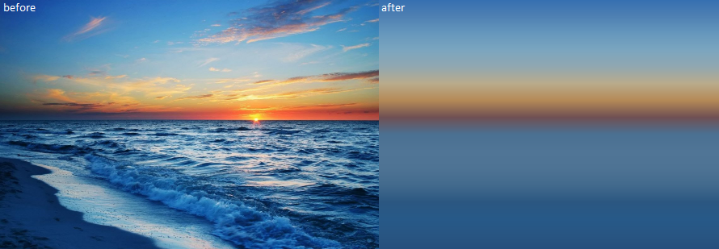

# image-to-gradient

This project allows you to easily create CSS gradients from images. The step 
count is variable. Any angle is supported. Alpha channel is also processed.

## Usage

There is one exported function with 3 parameters. You specify the path through
the first parameter, you pass in the options in the second parameter and you
pass in a callback function in the third parameter;

The example below creates a gradient from an image and generates a dummy html
file with the background set to the gradient.

    var imageToGradient = require('image-to-gradient');

    var options = {
        angle:10, // gradient angle in degrees
        steps:64  // number of steps
    }

    imageToGradient('testimage.jpg', options, function(err, cssGradient){
        if (err) throw err;
        var html = `
        <html>
            <head>
                    
            </head>
            <body>
            </body>
        </html>`
        var fs = require('fs');
        fs.writeFile('output.html', html, (err) => {
            if (err) throw err;
            console.log('The file has been saved!');
        });
    });

## What can I use it for?

[Here is an example how to speed up initial load!](https://mollwe.se/2017/12/15/hexo-lazy/)

 - Need a background? Create a gradient from an image.
 - Optimise site loading speed by initially replacing images with gradients.
 - Make art! The gradients are beautiful.
 - Need a palette? Create a gradient form an image, use it as a palette.

## Cool stuff

This is my first NPM module ever. But that does not mean it's useless! If you
find a use case let me know. If it's missing some feature that would make this
even better, again, let me know.
